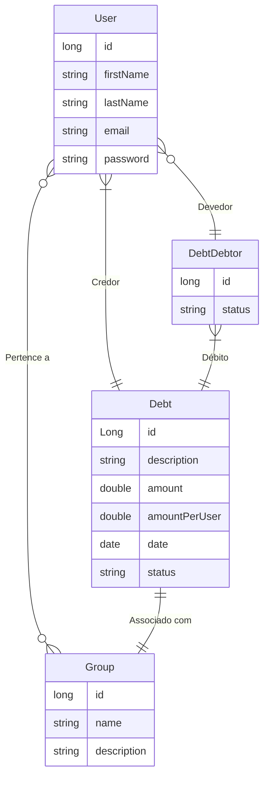
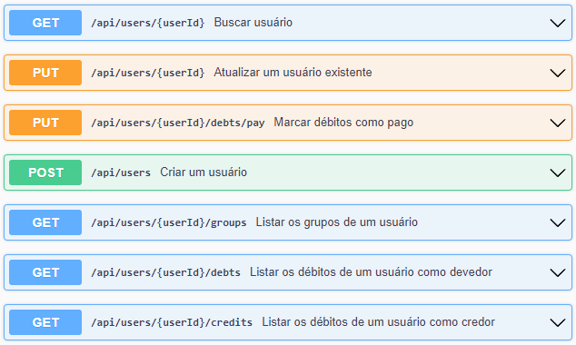
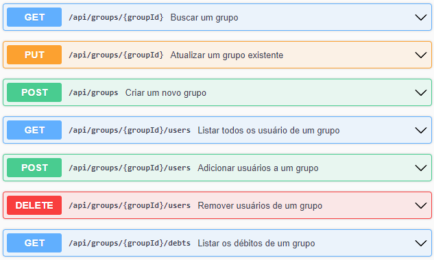
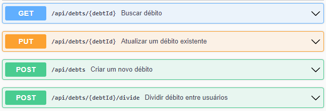

# Desafio API REST Spring Boot 3

O repositório possui a implementação em Spring Boot de uma api para a criação de dívidas entre usuários em um grupo.
## Principais Tecnologias
- **Java 17**: Utilizaremos a versão LTS mais recente do Java para tirar vantagem das últimas inovações que essa linguagem robusta e amplamente utilizada oferece;
- **Spring Boot 3**: Trabalharemos com a mais nova versão do Spring Boot, que maximiza a produtividade do desenvolvedor por meio de sua poderosa premissa de autoconfiguração;
- **Spring Data JPA**: Exploraremos como essa ferramenta pode simplificar nossa camada de acesso aos dados, facilitando a integração com bancos de dados SQL;
- **OpenAPI (Swagger)**: Vamos criar uma documentação de API eficaz e fácil de entender usando a OpenAPI (Swagger), perfeitamente alinhada com a alta produtividade que o Spring Boot oferece;

O sistema desenvolvido possui três entidades principais, os usuários, grupos e débitos (dívidas). Um usuário pode participar de
vários grupos. Um grupo pode ter vários usuários.

Um usuário dentro de um grupo pode criar um débito como credor. Esse débito do credor pode ser dividido entre outros
participantes do mesmo grupo. Como exemplo, podemos pensar em um grupo que possui pessoas morando na mesma casa.
Uma das pessoas resolve pagar a conta de energia elétrica. A ideia é dividir a conta de energia elétrica entre as
pessoas da casa. Como uma delas já pagou adiantado, essa pessoa que pagou vira um credor. As demais pessoas precisam
agora dividir igualmente o débito da conta de energia e pagar para a pessoa credora.

Um usuário pode ser credor de várias dívidas em um grupo, mas uma dívida credora só pertence a um usuário em um
grupo. Um usuário pode ter vários débitos em um grupo e um débito pode pertencer a vários usuários. Os débitos
possuem o estado de já foi pago ou não. Caso todos os débitos relacionados a um credor tiverem sido pagos, então
o estado da dívida relacionada a pessoa credora também deve ser alterado para pago.

Com essa descrição do problema, podemos ter o seguinte diagrama relacional.

A aplicação possui os seguintes endpoints:
- **Endpoints relativos a usuário**

- **Endpoints relativos a grupo**

- **Endpoints relativos a débito**

Mais detalhes sobre cada endpoint podem ser vistos após a execução da aplicação. Para testes locais, ao executar a
aplicação podemos encontrar as definições dos endpoints em ``localhost:8080/swagger-ui/index.html``.

Um arquivo ``.properties`` é fornecido com a configuração do banco de dados em memória H2. Esse arquivo está nomeado
como ``application-dev.properties``. Para informar a Spring utilizar esse arquivo, é preciso adicionar
a variável de ambiente ``SPRING_PROFILES_ACTIVE=dev``.

