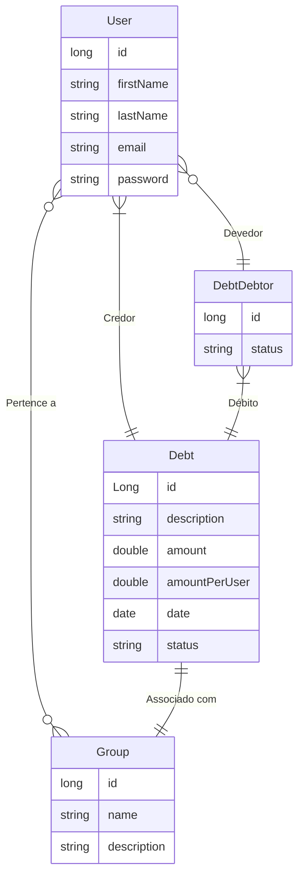

# Desafio API REST Spring Boot 3

O repositório possui a implementação em Spring Boot de uma api para a criação de dívidas entre usuários em um grupo.
O sistema possui três entidades principais, os usuários, grupos e débitos (dívidas). Um usuário pode participar de
vários grupos. Um grupo, pode ter vários usuários. 

Um usuário dentro de um grupo pode criar um débito como credor. Esse débito do credor pode ser dividido entre outros
participantes do mesmo grupo. Como exemplo, podemos pensar em um grupo que possui pessoas morando na mesma casa.
Uma das pessoas resolve pagar a conta de energia elétrica. A ideia é dividir a conta de energia elétrica entre as
pessoas da casa. Como uma delas já pagou atiantado, essa pessoa que pagou vira um credor. As demais pessoas precisam
agora dividir igualmente o débito da conta de energia e pagar para a pessoa credora. 

Um usuário pode ser credor de várias dividas em um grupo, mas uma dívida credora só pertence a um usuário em um 
grupo. Um usuário pode ter vários débitos em um grupo e um débito pode pertencer a vários usuários. Os débitos
possuem o estádo de já foi pago ou não. Caso todos os débitos relacionados a um credor tiverem sido pagos, então
o estado da dívida relacionada a pessoa credora também deve ser alterado para pago.

Com essa descrição do problema, podemos ter o seguinte diagrama relacional.

